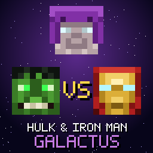
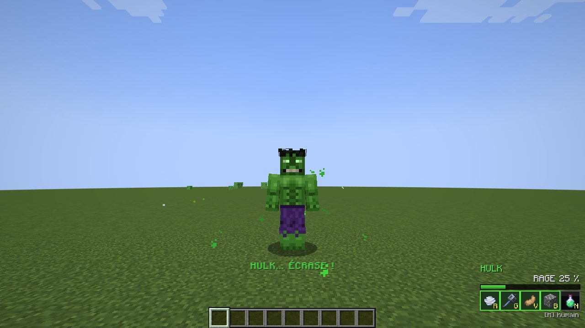
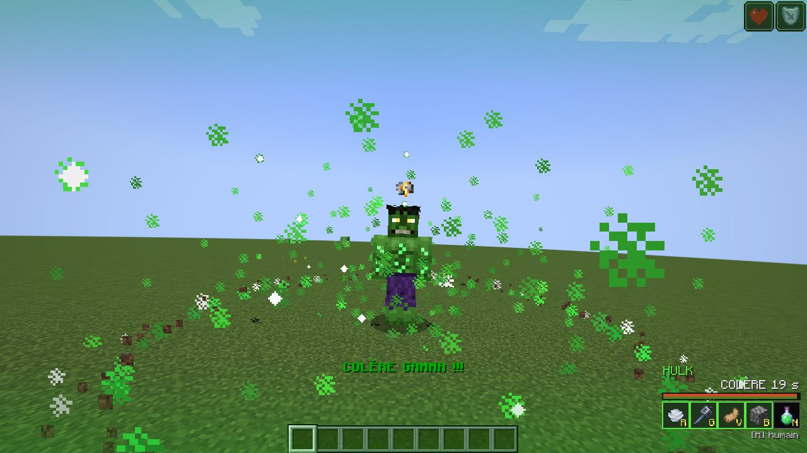
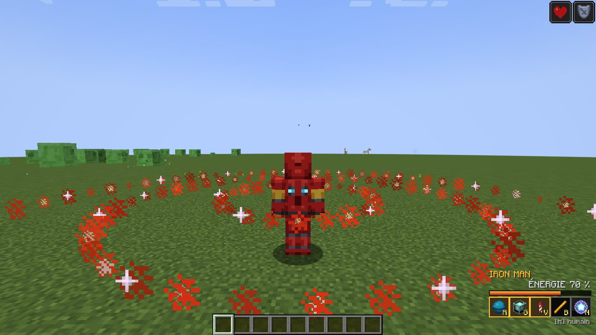
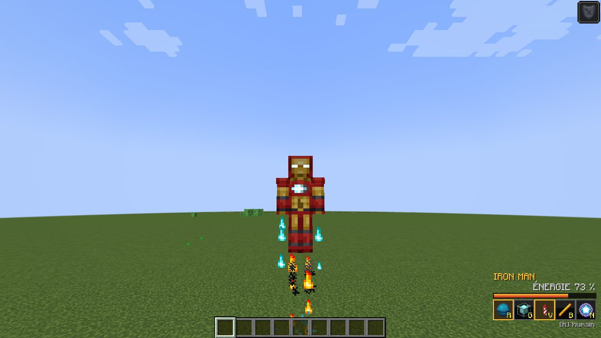
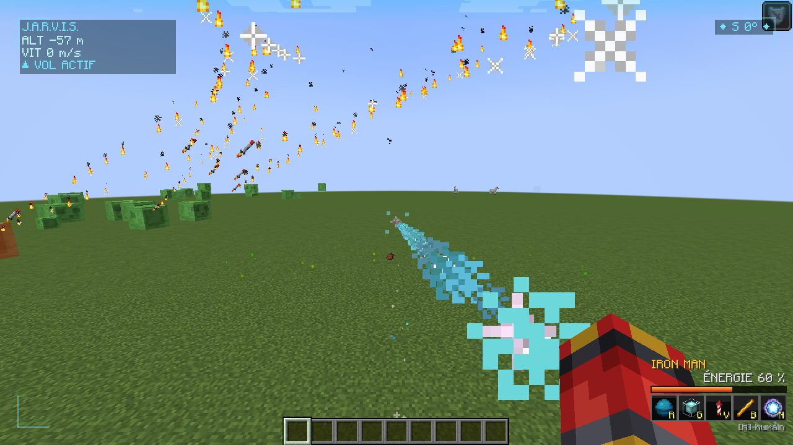
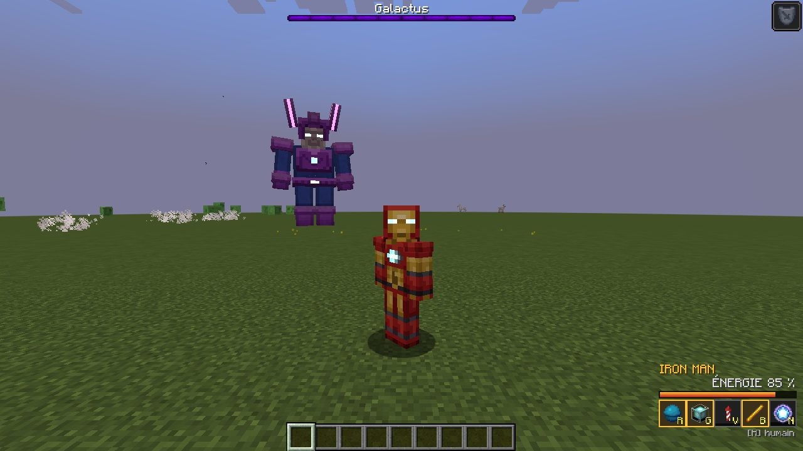
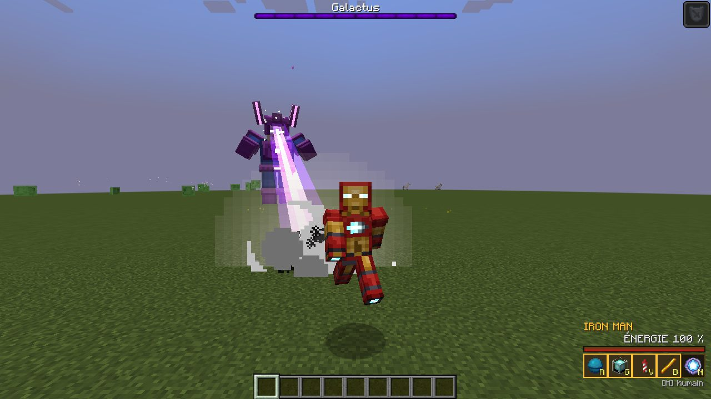
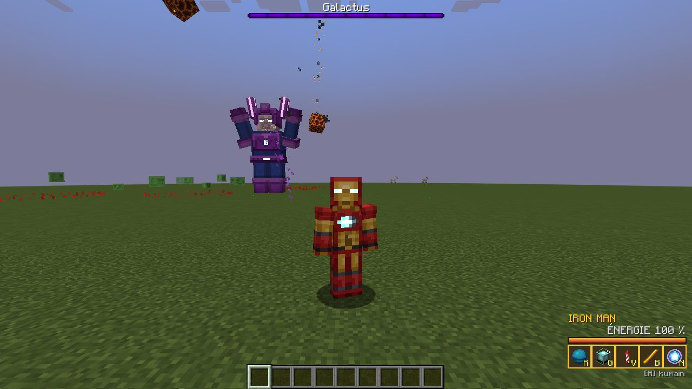

# 💚🔴 Hulk & Iron Man vs Galactus — mod Minecraft

Mod **NeoForge pour Minecraft 1.21.1** : transforme-toi en **Hulk** ou en **Iron Man**, déchaîne des pouvoirs spectaculaires et affronte **Galactus**, le Dévoreur de Mondes, un boss géant de 12 blocs de haut.

> Fan-made, gratuit et non officiel. Hulk, Iron Man et Galactus sont des marques de Marvel. Toutes les textures sont dessinées par le code (`tools/generate_textures.py`), rien n'est copié d'un autre jeu ou mod.



## 📸 En jeu
Captures prises automatiquement dans le vrai jeu par le test de GitHub Actions :

| | |
|---|---|
|  Hulk |  Colère gamma |
|  Laser circulaire d'Iron Man |  Vol d'Iron Man |
|  HUD J.A.R.V.I.S. et répulseur |  Galactus |
|  Rayon cosmique |  Pluie de météores |

## 📥 Installer et jouer

1. Installe **NeoForge 1.21.1** : avec l'appli CurseForge, crée un profil *Minecraft 1.21.1* avec le chargeur *NeoForge* ; sans l'appli, prends l'installeur sur [neoforged.net](https://neoforged.net).
2. Récupère le fichier `hulkironman-1.0.0+neoforge-1.21.1.jar` (voir *Récupérer le .jar* plus bas).
3. Mets-le dans le dossier `mods` du profil (dans l'appli CurseForge : clic droit sur le profil → *Ouvrir le dossier*).
4. Lance le jeu. Tout se trouve dans l'onglet créatif **Hulk & Iron Man vs Galactus**.

### Récupérer le .jar
Le mod est compilé automatiquement par GitHub à chaque modification :
**onglet Actions** du dépôt → dernier passage vert de « Mod Minecraft (NeoForge 1.21.1) » → section *Artifacts* → `hulkironman-neoforge-1.21.1` (un zip qui contient le `.jar`).

Pour le compiler soi-même (Java 21 nécessaire) :

```bash
cd minecraft-mod
./gradlew build          # le .jar arrive dans build/libs/
./gradlew runClient      # lance Minecraft avec le mod pour tester
```

## 🎮 Objets

| Objet | Recette | Utilisation |
|---|---|---|
| **Sérum Gamma** | sans forme : fiole vide + émeraude + poudre de glowstone + boule de slime + colorant vert clair | Clic droit : devenir **Hulk** (encore une fois : redevenir humain) |
| **Réacteur Arc** | lingots de fer aux coins, redstone sur les côtés, diamant au centre | Clic droit : revêtir l'armure d'**Iron Man** |
| **Orbe Cosmique** | yeux de l'Ender aux coins, éclats d'améthyste sur les côtés, bloc de diamant au centre | Clic droit sur le sol : **invoquer Galactus** |
| **Cœur Cosmique** | butin de Galactus | Dans l'inventaire : recharges 1,5× plus rapides, énergie doublée |

Le sérum et le réacteur ne sont pas consommés. La touche **H** transforme aussi (si l'objet est dans l'inventaire) et fait redevenir humain. Mourir rend la forme humaine.

## 💪 Hulk
Hulk mesure presque 3 blocs, a 30 cœurs, une armure solide, cogne à 15 dégâts, saute très haut, casse les blocs 4× plus vite et ne prend **jamais de dégâts de chute**. Chaque coup de poing projette les ennemis avec une explosion.

| Touche | Pouvoir | Effet |
|---|---|---|
| **R** | Clap de tonnerre | Onde de choc en cône sur 16 blocs : dégâts, projection, étourdissement, détruit les flèches et projectiles |
| **G** | Hulk Smash | Au sol : bond puis écrasement (onde de choc et débris). En l'air : **plongeon météore**, d'autant plus fort que la chute est haute |
| **V** | Saut gamma | Bond gigantesque dans la direction du regard ; l'atterrissage fait trembler le sol (enchaîne avec G en l'air !) |
| **B** | Lancer de rocher | Arrache un bloc du sol sous tes pieds et le lance : il explose à l'impact |
| **N** | **Colère gamma** (ultime) | Il faut 100 % de rage (frapper et encaisser des coups la remplit). Rugissement, explosion gamma géante, puis 20 s de rage : plus grand, plus fort, plus rapide, recharges 2× plus rapides, yeux rouges |

## 🦾 Iron Man
40 PV, armure énorme, et surtout **le vol** : **double saut** pour décoller (comme en créatif), **Sprint** pendant le vol pour le **turbo** dans la direction du regard. HUD J.A.R.V.I.S. en vue subjective : altitude, vitesse, boussole, verrouillage de cible.

| Touche | Pouvoir | Énergie | Effet |
|---|---|---|---|
| **R** | Répulseur | 5 | Tir d'énergie instantané (main gauche, main droite…) |
| **G** | Unirayon | 25 | Le réacteur se charge puis tire un rayon massif pendant 1 s |
| **V** | Micro-missiles | 20 | 8 missiles à tête chercheuse, chacun vers un ennemi différent |
| **B** | Laser circulaire | 30 | Un anneau laser s'étend autour de toi et tranche tout (et enflamme) |
| **N** | **Frappe orbitale** (ultime) | 100 | J.A.R.V.I.S. verrouille jusqu'à 16 ennemis et un satellite les frappe depuis le ciel |

L'énergie se recharge toute seule.

Les attaques de zone ne touchent que les **ennemis** (monstres, ou créatures qui t'attaquent) : jamais tes animaux apprivoisés, les villageois ou les autres joueurs. Rien ne détruit le décor.

## 🌌 Galactus, le Dévoreur de Mondes
Boss de **1000 PV**, 12 blocs de haut, avec barre de boss violette. Il descend du ciel quand on utilise l'Orbe Cosmique et parle dans le chat.

- **Rayon cosmique** : il charge ses yeux puis balaie avec un rayon violet qui te suit lentement. Cours sur le côté ou cache-toi derrière un mur !
- **Pluie de météores** : des **cercles rouges** apparaissent au sol, sors-en vite.
- **Choc tellurique** : il lève les bras et frappe le sol, une onde s'étend sur 24 blocs. **Saute** au bon moment pour l'éviter.
- **Puits gravitationnel** : il t'aspire pendant 3 s puis dévore tout ce qui est près de lui (et se soigne). Éloigne-toi ou envole-toi !
- **Hérauts** : il invoque des esprits violets qui t'attaquent.
- **Phases** : à 50 % puis 25 % de vie, il devient plus rapide et plus dangereux ; en phase 3 les météores tombent sans arrêt.
- S'il est coincé ou trop loin, il fait un « pas cosmique » et se téléporte près de toi.

Butin : **Cœur Cosmique**, étoile du Nether, 8 à 16 diamants, 1 à 3 lingots de netherite, parfois une nouvelle Orbe, et beaucoup d'expérience.

## ⚙️ Commandes
Toutes les touches se changent dans *Options → Commandes → Hulk & Iron Man*. Elles sont au même endroit en AZERTY et en QWERTY. Les tremblements d'écran suivent l'option d'accessibilité *Distorsion de l'écran* (mets-la à 0 pour les couper).

| Touche | Action |
|---|---|
| H | Se transformer / redevenir humain |
| R, G, V, B | Pouvoirs 1 à 4 |
| N | Pouvoir ultime |

## 🧱 Code
```
src/main/java/io/github/lomdjudd/hulkironman/
  HulkIronMan.java         point d'entrée du mod
  hero/                    formes (attributs), état, pouvoirs de Hulk et d'Iron Man, outils de combat, planificateur
  entity/                  Galactus (IA en 3 phases), rocher/météore, micro-missile
  item/                    sérum, réacteur, orbe, cœur cosmique
  network/                 paquets client <-> serveur (touches, état, effets, poussées, tremblements)
  client/                  touches, interface, effets de particules, modèle et rendu de Galactus, couche lumineuse
  mixin/                   skin de Hulk / Iron Man à la place du skin du joueur
  event/                   événements du jeu et auto-test serveur (./gradlew runSelfTest)
  client/ClientTest.java   test visuel : captures d'écran automatiques (./gradlew runClientTest)
src/main/resources/        textures, traductions FR/EN, recettes, butin, succès
tools/generate_textures.py génère toutes les textures (et un aperçu 3D avec --preview DOSSIER)
```

À chaque modification, GitHub Actions compile le mod puis lance un **auto-test sur un vrai serveur** : un joueur factice se transforme, utilise tous les pouvoirs, puis Galactus est invoqué, lance chacune de ses attaques, passe ses phases et meurt. Ensuite un **vrai client Minecraft** démarre sur un écran virtuel et prend des captures d'écran (artefact `captures-ecran`).

Pour publier sur CurseForge, le texte de présentation prêt à coller est dans [`CURSEFORGE.md`](CURSEFORGE.md).
